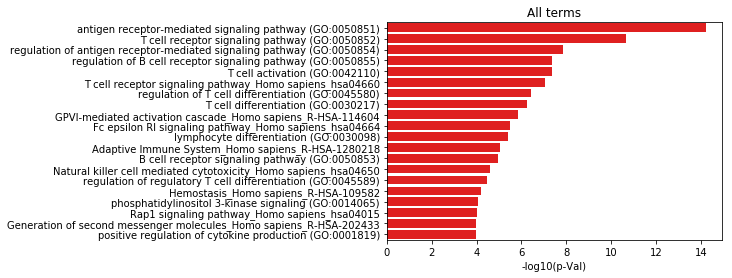

# EnrichRLib 

This is a simple package for enrichment analysis with clustering.
[EnrichRLib](https://github.com/Benja1972/gene-enrichment/)

# Quick start

```python
import pandas as pd
import matplotlib.pyplot as plt
```


## Import ErichRLib

```python
import EnrichRLib as erl
```
Gene list may be imported from file or direct entered in code as list object

```python
gl = ['PTPN22', 'CTLA4', 'PIK3CD', 'THEMIS', 'LCP2', 'GATA3', 'LAT','RUNX1', 'BLK', 'PTPN22']
```

# Fetching gene sets from Enrichr website 

Get gene-set libraries from 
 <big>EnrichR</big> [https://amp.pharm.mssm.edu/Enrichr](https://amp.pharm.mssm.edu/Enrichr)

Define sub directory where gene sets in .gmt format will be placed


```python
lib_dir='_tmp'

# List of gene sets to fetch, by default all gene sets will be fetched
gss = [ 
       'GO_Biological_Process_2018',
       'GO_Cellular_Component_2018',
       'GO_Molecular_Function_2018',
       'KEGG_2016',
       'Reactome_2016'
       ]

erl.get_Enrichr(out_dir='_tmp', libs=gss)
```

    Directory  _tmp  already exists
    GO_Biological_Process_2018  -- DONE
    GO_Cellular_Component_2018  -- DONE
    GO_Molecular_Function_2018  -- DONE
    KEGG_2016  -- DONE
    Reactome_2016  -- DONE


# Enrichment to several gene sets: batch analysis


```python
enrr = erl.enrich_gs(gl,gss, path_lib=lib_dir)
```

    GO_Biological_Process_2018 286
    GO_Cellular_Component_2018 9
    GO_Molecular_Function_2018 40
    KEGG_2016 82
    Reactome_2016 102


### Sort and plot top terms 


```python
import seaborn as sns

enrr.sort_values('p-Val', axis=0, inplace = True)
ds = enrr.head(20)

f, ax = plt.subplots()
sns.barplot(y=ds.index,
            x='-log10(p-Val)',
            ax = ax, 
            color="Red", 
            data = ds)
ax.set_title('All terms')
```


    Text(0.5,1,'All terms')





## Clastering: cluster terms and plot clustered


```python
## Cluster: this calculate and add cluster number column
enrr = erl.cluster(gl,enrr)

# Make additional calculation on existing columns for visualization
enrr.loc[:,'ass_genes_percnt'] = 100*enrr.loc[:,'num_list']/enrr.loc[:,'num_term']
enrr.sort_values('cluster', axis=0, inplace = True)

# use consistent discrete palette
cm = 'tab20'

ds = enrr.head(40)

f, ax = plt.subplots(figsize=(8, 10))
sns.barplot(y=ds.index,
            x='-log10(p-Val)',
            ax = ax, 
            hue ='cluster',
            dodge=False,
            data = ds,
            palette = cm)
ax.set_title('All terms')
```


    Text(0.5,1,'All terms')


# Network construction based on cluster

Graph and network:
control conectivity by kappa score parameter, default kappa=0.4


```python
G,enrrr, nt = erl.make_graph(gl, enrr, kappa=0.4)
```


```python
erl.draw_graph(G, spring=15, pval_prcnt=0.5, palette=cm)
```


